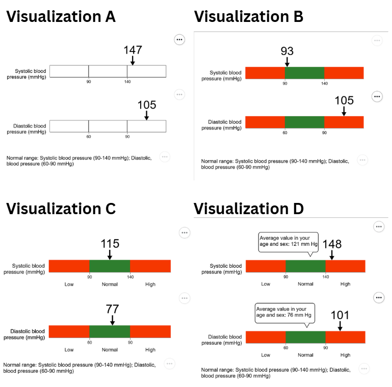

Members: Zoe Fisk, Skyler Lin, Morgan Vasiliou

# Note
We did not replicate the Cleveland and McGill study and instead chose another study to replicate. We checked our study with Professor Harrison and got confirmation that our study would be ok to replicate in Vega. Additionally, the visualization type we chose to replicate is a part of our MQP. Our MQP team consists of the members of this team (Zoe Fisk, Skyler Lin, Morgan Vasiliou) and another student from this CS4804 class, Zach Medailleu. Zach contributed to the technical and design achievements of these number lines.

# Original Study
In 2022, Liu et al. published a paper exploring how various contextual cues influence digital health information for younger vs. older adults using eye-tracking (https://doi.org/10.3390/su142416506). This study explored a visualization type called reference range number lines (RRNLs), which are a variant of number lines where an exact value is indicated along a scale and categorical ranges are visually noted along that scale (e.g., normal and abnormal ranges).

The variables for this study were age and visualization type. Age was classified into younger (age 18-40 years old) and older (60+ years old). Visualization types were classified as A, B, C, and D where each subsequent visualization added another contextual cue from the previous one. A was a RRNL with no color, B was the same visualization with colored reference ranges, C was the same as Vis B but included category labels (low, normal, high), and D was the same as C but included a speech bubble to indicate the average value for the participants age and sex along the number line.

Figure 1: Examples of original stimuli from the study.

In the original study, participants were shown a RRNL showing blood glucose or blood pressure values and were asked to indicate the exact value being shown on the number line and whether or not that value fell within normal ranges. The accuracy and time of task completion were measured, as were eye-tracking measures such as time to first fixation. Because of convenience sampling constraints, we were not able to collect data on older adults (60+) and only collected data for young adults (18-40). Additionally, we were not able to use eye-tracking measures because of equipment constraints. Our project instead focuses on replicating the accuracy and time of completion results for all visualization types for younger adults.

# Our study
We recreated each of the visualization types for both normal and abnormal results of blood glucose and blood pressure conditions as done in the original study.

Figure 2: Our replicated visualizations using Vega.
 

This amassed to 16 total visualizations: 4 vis types x 2 possibilities for normal x 2 test measures.

In our study, participants were shown one of the 16 visualizations and asked 4 questions: 2 asking for the exact value of each number line and 2 asking for value interpretation of each value. For example, a blood pressure visualization including both systolic and diastolic values, such as the above number lines, would be accompanied by these 4 questions:

1. What is the systolic value?
2. What is the diastolic value?
3. Is the systolic value normal?
4. Is the diastolic value normal?

The time it took to complete the four questions was recorded. The participant completed this task with 8 different visualizations then was given a 2 minutes break, and completed the last 8 visualizations. The visualizations were shown in random order. At the end of the study, the participant was shown their answer and the correct answer for each question.

## Data Analysis
We replicated the data analysis for all visualizations types and younger adults for this study with one limitation. Because of how our ReVisit study was designed, we did not have different task completion times for the two different question types. Instead, we collected the task completion time it took to answer all four questions for a visualization and plotted that against the vis types. With this limitation in mind, we tried our best to replicate Table 1 (Task completion time and accuracy rate by visualizations and age.) and Figure 3 (Interaction effects of visualization and age on accuracy rate and task completion time for the verbatim comprehension task and the value interpretation task.) from the original study. Our results are as follows:

Table 1: Interaction effects of visualization on accuracy rate and task completion.

** INSERT OUR FINAL TABLE HERE **

Figure 3: Accuracy rate and task completion time by visualizations. Error bars show standard errors.

** INSERT OUR FINAL FIGURE(S) HERE **

## Brief Analysis of our Results

** DO SOME ANALYSIS ON WHETHER OR NOT WE REPLICATED The STUDY **

# Technical Achievements
- Created a Vega file of a basic RRNL that could be manipulated for further customization (Zach Medailleu completed this).
- Incorporated a ReVisit page that included a manditory break time.
- Incorporated a ReVisit page that showed each question answered and whether the participant got the answer correct or incorrect.

# Design Achievements
- Replicated the orientation of the arrow in each of the RRNLs (on top of the number line pointing down at the value).
- Replicated the speech bubble design of Vis type D for each graph.
- Oriented multiple HTML elements so the relative orientation of RRNLs and text could be replicated from the study (Zach Medailleu assisted with orienting multiple RRNLs).
- Visual design of the ReVisit page that showed each question and the participant's accuracy.
