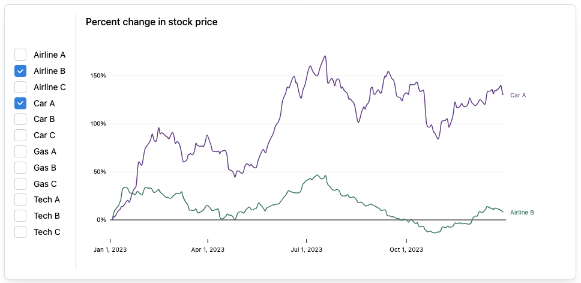
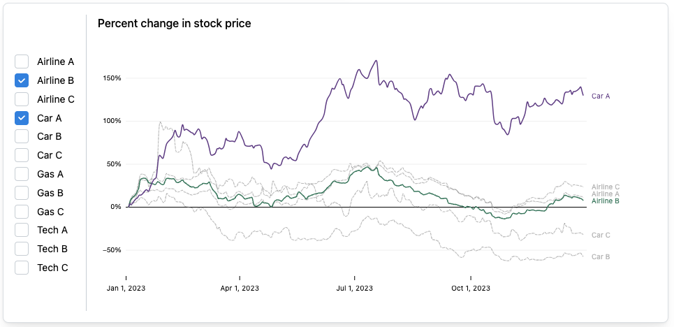
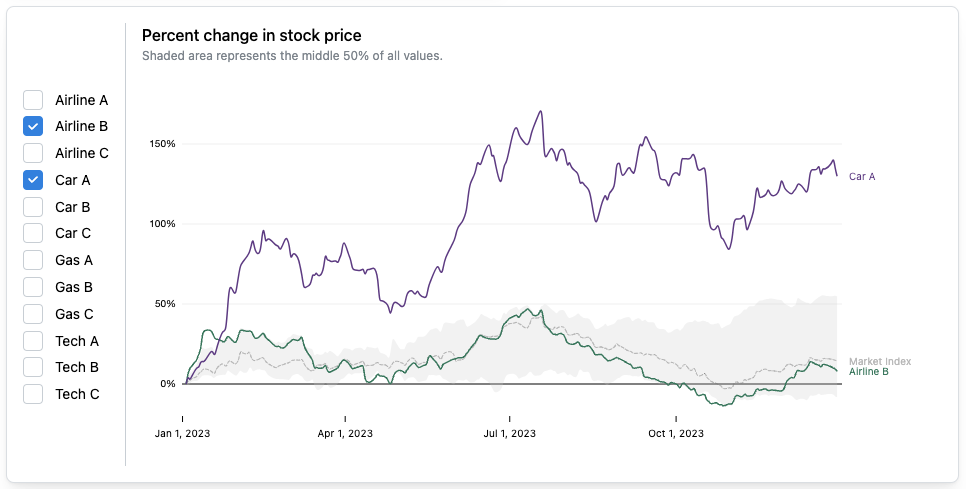
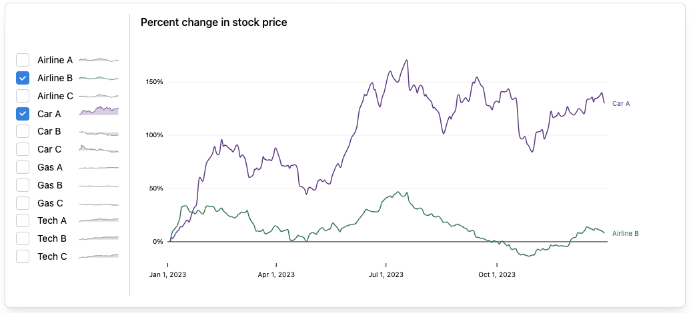
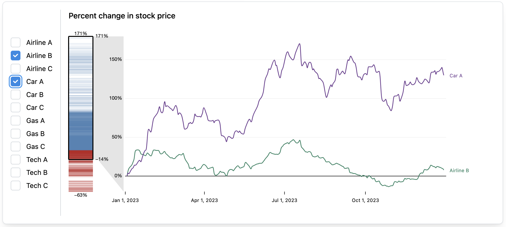

# Post-study survey

Thank you for completing the tasks! This is the last page of the assignment. 

After completing the questions below and clicking the "Next" button, you will be redirected back to Prolific.

## Visualization Guardrails

You may have noticed that the visualizations looked different between different tasks.

In the image below, you can see a simple interface (at the top) and 4 different **guardrail interfaces** (at the bottom).

***Simple interface:*** 

***Guardrail interface 1:*** (shows all items from the selected groups)

***Guardrail interface 2:*** (shows the average value of all the data, and the area where 50% of the data falls)

***Guardrail interface 3:*** (shows a miniature version of all the data on the side)

***Guardrail interface 4:*** (shows the range of values for all the data on the side)

## Questions

Please answer the questions below about your experience completing the tasks:

___